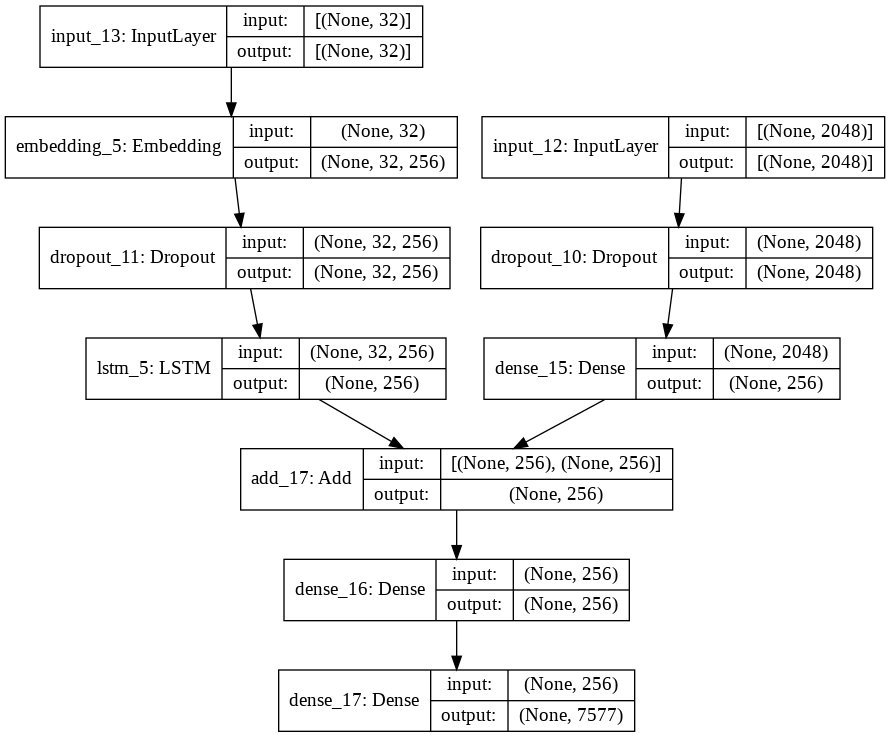

# Image Captioning using CNN and RNN

This repository contains code for an image captioning model that combines Convolutional Neural Networks (CNN) and Recurrent Neural Networks (RNN) to generate descriptive captions for images. The model is trained on the Flickr8k dataset.

## Getting Started

### Prerequisites

Make sure you have the following dependencies installed:

- Python 3.x
- Keras
- TensorFlow
- PIL
- tqdm
- numpy

### Installation

Clone the repository to your local machine:

```bash
git clone https://github.com/your-username/your-repository.git
cd your-repository
```

### Dataset

Download the Flickr8k dataset from [here](https://forms.illinois.edu/sec/1713398) and extract the contents into the `data` folder.

## How can I run this project?

1.  Download and extract [Flickr8k_Dataset.zip](https://drive.google.com/file/d/1Y37dUIocd2hjADk7FmMP-ptmzAssFQcN/view?usp=sharing) and [Flickr8k_text.zip](https://drive.google.com/file/d/179RcanAzTFNXguIboXn2ZI1hx7tWKk16/view?usp=sharing)

2.  Now, create a folder named 'ML' in root directory of your Google Drive.

3.  Then upload extracted version of `Flickr8k_Dataset` and `Flickr8k_text` into the ML folder. This will take times depending on your IP provider.

4.  Also upload the `testing_caption_generator.py` into ML folder.

5.  Now create a notebook in Colab by your preferred name, and copy paste from `ImageCaption.ipynb`

6.  Run all the shells. Happy CODING :)


## Code Structure

- `image_captioning.ipynb`: Jupyter notebook containing the code for data preprocessing, model training, and saving the model.
- `testing_caption_generator.py`: Python script for testing the trained model on new images.
- `utils.py`: Utility functions for data loading and processing.
- `data/`: Folder to store the Flickr8k dataset.

## VISUAL REPRESENTATION OF MODEL


## Acknowledgments

- The code is inspired by the [Show and Tell: A Neural Image Caption Generator](https://arxiv.org/abs/1411.4555) paper.
- The pre-trained Xception model is used for image feature extraction.


